# PUBG 1.9 ESP Hack for Emulator (C++ Source Code)

---
|**\* This is not the full protected version**|
| --- |
|**\* Contact us if you wish to get the full protected version**|
---

PUBG ESP Hack for Emulator using C++ code.\
Player Position, Bones, Loots, Weapons, Vehicles, Boxes ... etc.

* **official Site** : Zero One Billion ( [www.01000000000.com](https://www.01000000000.com) )
* **Auther** : Programmer / Ayman
* **E-mail** : [info@01000000000.com](mailto:info@01000000000.com)
* **Tutorial** : [Playlist](https://mega.nz/folder/aG4nwA7Q#GXPgPHtQopvsXzHJebNKsA)
* **Discord** : [Discord](https://discord.gg/AbeqUxsf2E)

Preview Video ( [https://mega.nz/file/OOgXTIaB#Gy_KWGW3uDknTaAq01F9IMYPSXlrV7eFYJMiT18_ys8](https://mega.nz/folder/aG4nwA7Q#GXPgPHtQopvsXzHJebNKsA) )

[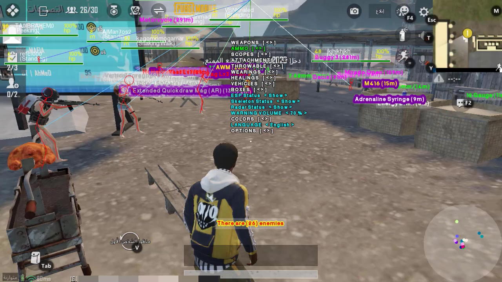](https://mega.nz/folder/aG4nwA7Q#GXPgPHtQopvsXzHJebNKsA "PUBG 1.9 Hack : PUBG Cororna Hack ببجي كورونا هاك")

## Tutorial
Playlist ( [https://mega.nz/folder/aG4nwA7Q#GXPgPHtQopvsXzHJebNKsA](https://mega.nz/folder/aG4nwA7Q#GXPgPHtQopvsXzHJebNKsA) )

| # | Video | Title |
| --- | --- | --- |
| 1 | [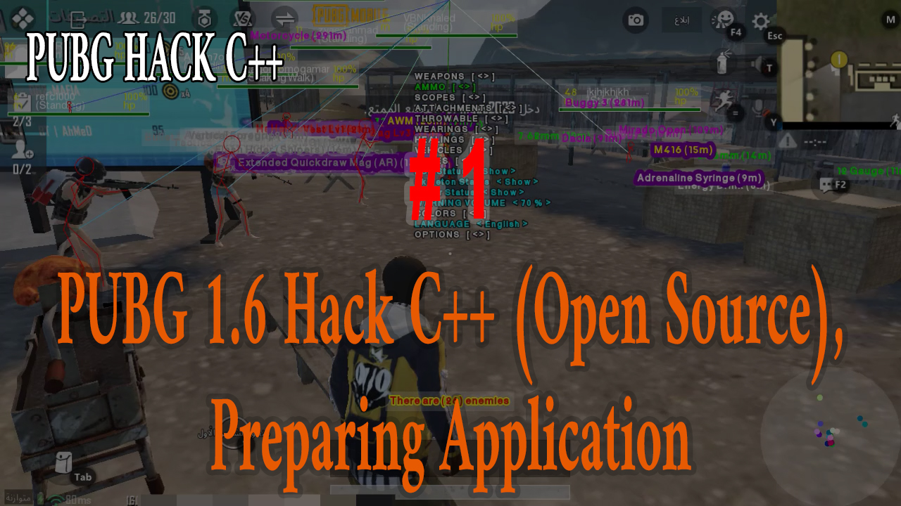](https://mega.nz/file/rD4jRQjK#G9kQ005r1w_MmdYXLecgMwzvIShIK7ul2EdheUiZdc0 "1- PUBG 1.9 Hack C++ (Open Source), Preparing Application") | PUBG 1.9 Hack C++ (Open Source), Preparing Application |
| 2 | [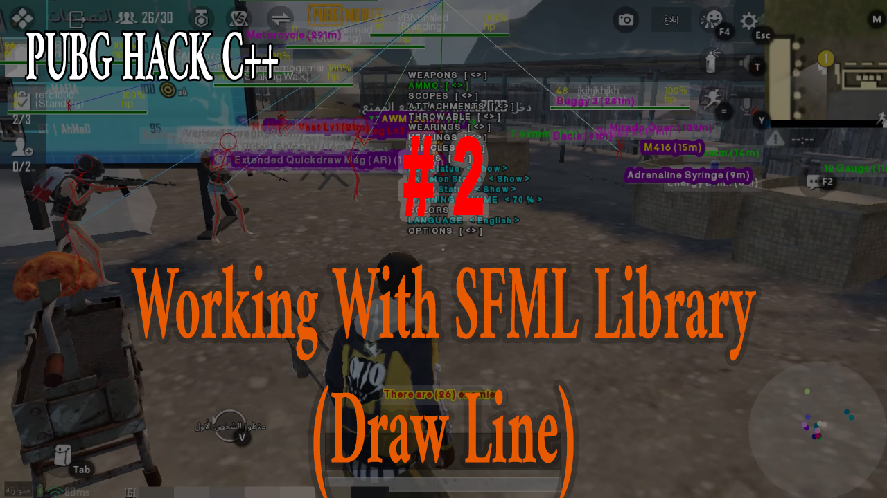](https://mega.nz/file/yXg0lDQB#ujSYSu0CfLkgHPTrGBonOtak-2SlvzV9JSozMepbzyU "2- Working With SFML Library (Draw Line)") | Working With SFML Library (Draw Line) |
| 3 | [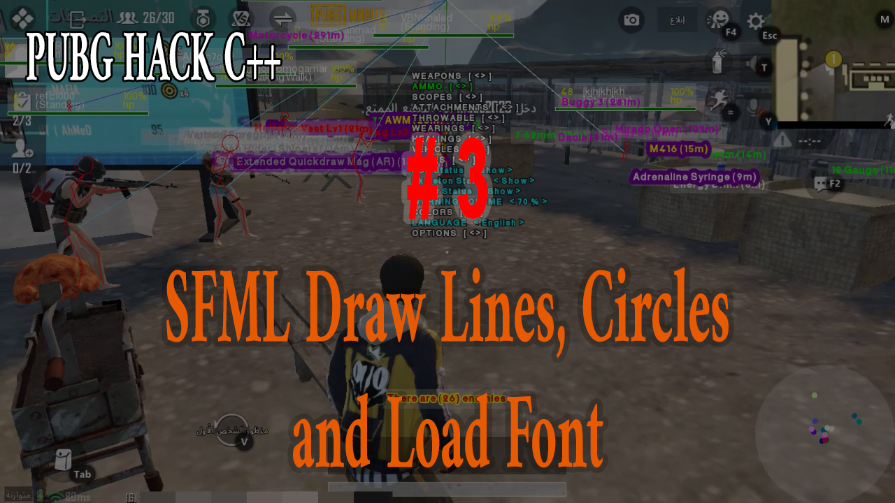](https://mega.nz/file/na4kRboJ#hSIo9Jp4th0F0sLpG8myEQR-GBRY0MsLFWreWyqtl-Q "3- SFML Draw Lines, Circles and Load Font") | SFML Draw Lines, Circles and Load Font |
| 4 | [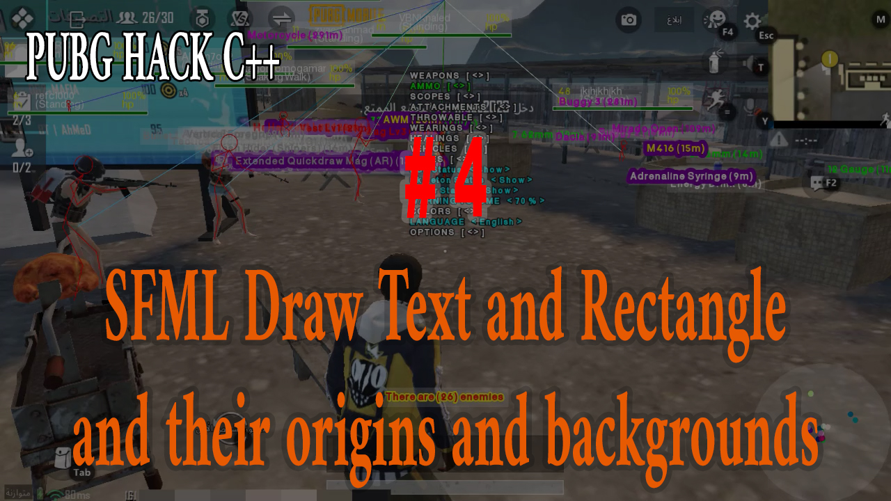](https://mega.nz/file/qLxF3CDD#fViIyH3DmuhP-doJP2DTvaYSNmChsLICcw_sSpvyRqY "4- SFML Draw Text and Rectangle and their origins and backgrounds") | SFML Draw Text and Rectangle and their origins and backgrounds |
| 5 | [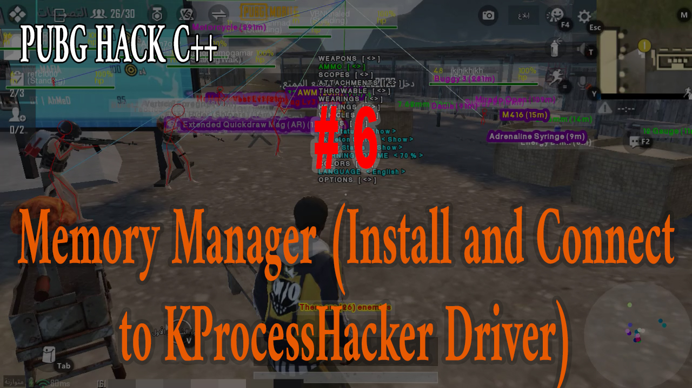](https://mega.nz/file/XKpE1RwK#jJEEaUPWYySQq2K8WRoTSfMHUZKeS4vFYE8WuqbybCc "5- SFML Load and Play Sound") | SFML Load and Play Sound |
| 6 | ") | Memory Manager (Install and Connect to KProcessHacker Driver) |
| 7 | [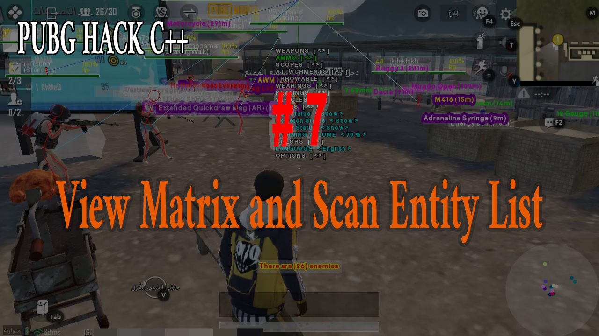](https://mega.nz/file/Ge5lyarR#Rv7cCMeqAouHCgAcy7iJPc3EPO_DBeRCknK4kv590e4 "7- View Matrix and Scan Entity List") | View Matrix and Scan Entity List |
| 8 | [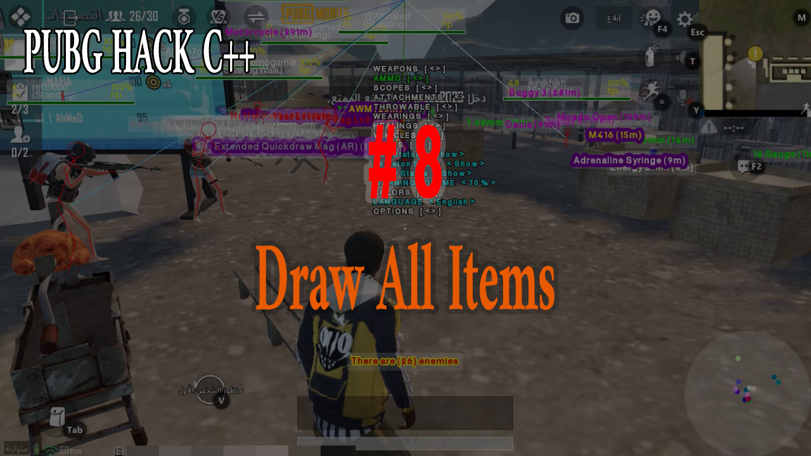](https://mega.nz/file/KfggQD4a#N6EeCMukv7KZbVz4meoyfHzu7ge3JgqMGeXbD0L0KiM "8- Draw All Items") | Draw All Items |
| 9 | [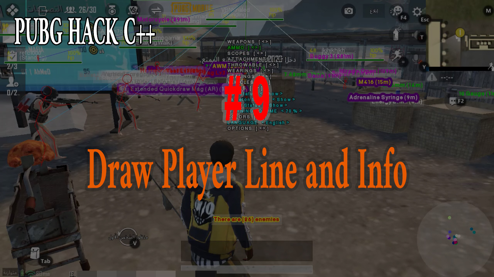](https://mega.nz/file/bSwUlbZR#xkCyU1Ngvg1iadePjHqCENeHDM2oVVKt18FPM0KudA4 "9- Draw Player Line and Info") | Draw Player Line and Info |
| 10 | [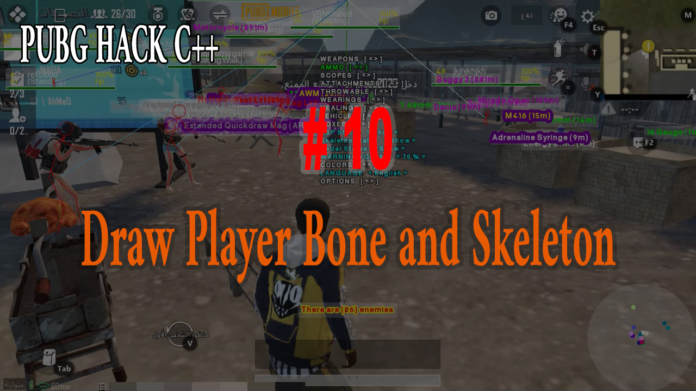](https://mega.nz/file/bHwwyRrC#yIIDDh1biUrwClTCQj4bfr-m-Bjgb4g3EeO1-XOUmMw "10- Draw Player Bone and Skeleton") | Draw Player Bone and Skeleton |
| 11 | [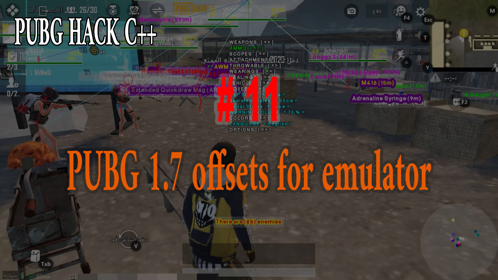](https://mega.nz/file/SC4HSChD#YCwsTsLURBCJ5dkPSIRhpaHQ45PGlGniMK_S3FZA_1g "11- PUBG 1.7 offsets for emulator") | PUBG 1.7 offsets for emulator |

## About
* This is for educational purposes only and I don't encorage using hacking
* This is not shared app or ready to use application, it is just example for how to use memory reader and to know how games working
* There are many ways to avoid ban but I will not talk about them in this tutorial
* Using this code as it is without any protection, may cause ban for your account and it is only on your responsibility

## My work
* Radar points for enemies
* Updating offsets for latest version of the game
* Updating items name and adding the neo
* Different color for each player (in the same team) for enemy line and radar point
* Menu controller for every single item to control its appearence
* Different color for each item type (weapons, vehicles, throwables ... etc.)
* Fix issues to perform speed and smooth working for the application
* And more

## Working on
* Dead player box and airdrop items list
* Car fuel and health
* Write on memory (Fast landing speed, Auto aim, Magic bullet, Car speed, Flying car, High jump and Fast running)

## References
@[github/atiksoftware](https://github.com/atiksoftware/pubg_mobile_memory_hacking_examples)\
@[www.unknowncheats.me](https://www.unknowncheats.me/forum/playerunknown-s-battlegrounds/)
